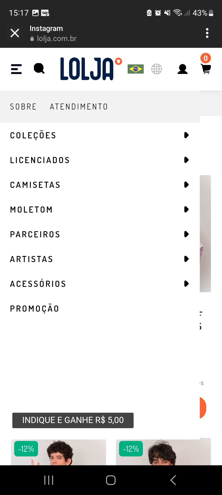
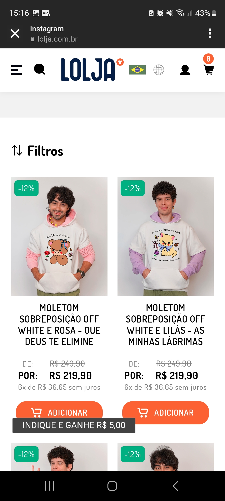
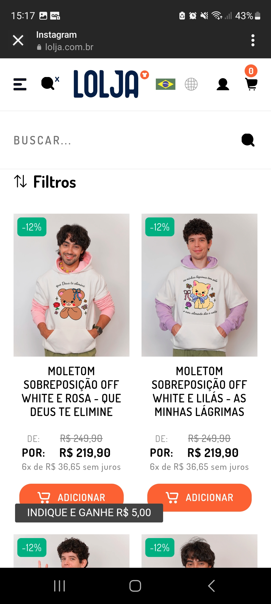
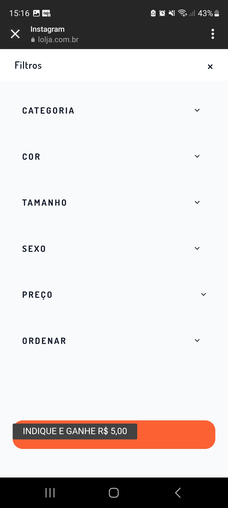
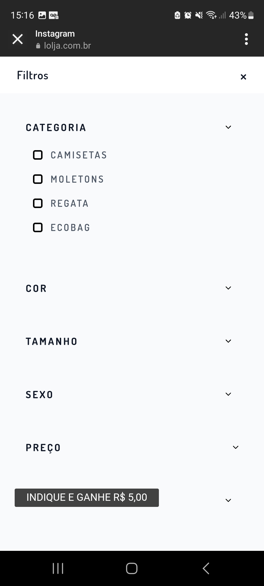
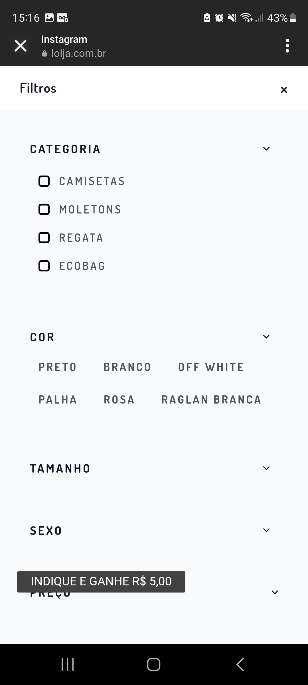
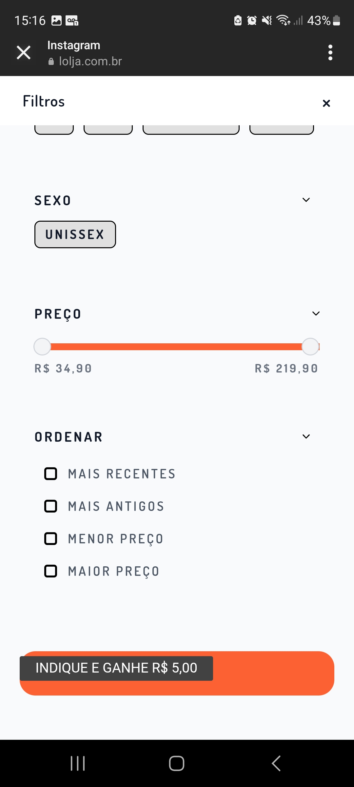

# Backend da loja da Spinning Joias

## TO DO
1. O Usuário deve poder criar uma conta
1.1 Para o cadastro, os campos obrigatórios são Nome Completo + cpf + whats + email + endereço (cep + estado + cidade + bairro + rua + numero + completo)
1.2 Deve ser informado que os campos obrigatório são para facilitar o envio de produtos
1.3 O campo opcional é data de nascimento

2. O Usuário deve poder selecionar 1 ou + produtos para comprar
2.1 Os produtos devem ser apresentados no carrinho
2.2 O carrinho deve conter, além dos produtos selecionados, o subtotal da soma dos produtos
2.3 O carrinho deve ter o campo para informar o CEP e calcular automaticamente a médida de valor do frete
2.4 O CEP deve ser previamente preenchido pelo CEP informado no cadastro, mas pode ser editado

3. Para comprar, é necessário logar, deve ser selecionado ao menos um produto, deve ser preenchido o campo do CEP, e deve ser selecionada a opção de pagamento (pix/transferência)
3.1 Para o pagamento, deve ser informado que cartões são aceitos apenas em eventos de patinação.
3.2 Ao clicar para comprar deve ser gerado um texto automatico com os dados da compra para o whats da spinning
3.3 Os dados do texto devem conter os campos obrigatórios do cadastro + dados do carrinho

4. Os produtos devem conter:
- categoria
- nome
- descrição
- preço
- imagem
4.1 Os produtos podem conter:
- material
- cores
- "veja também" com um produto relecionado

5. As cores dos produtos devem conter o nome das cores e imagem da cor

5. O site deve possibilitar pesquisar por campo de search e campo de select
5.1 Deve ter select de ordem alfabética e/ou preço

Site inspiração:

